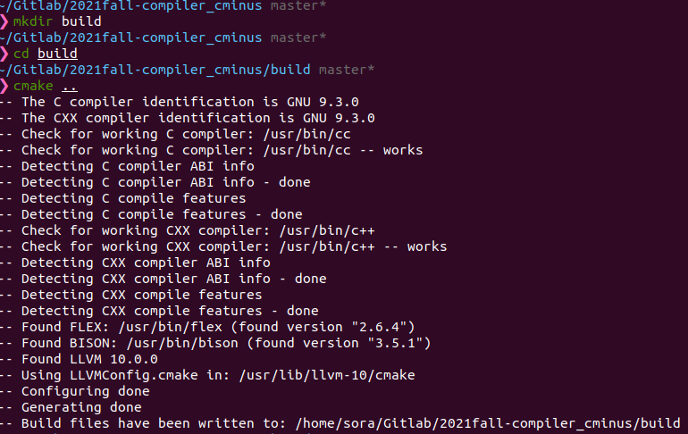
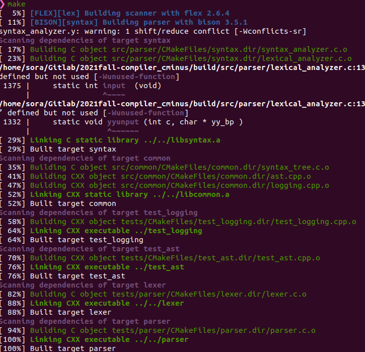
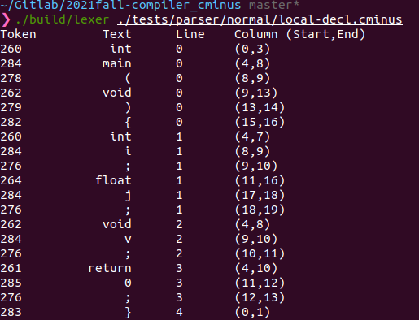
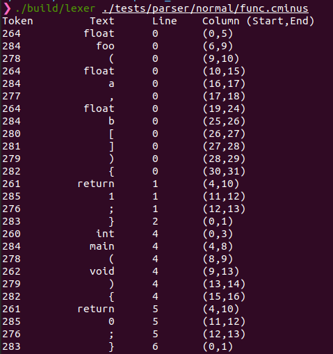
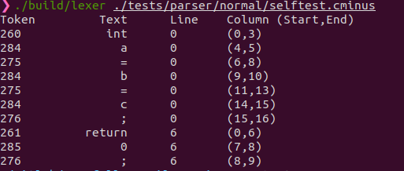
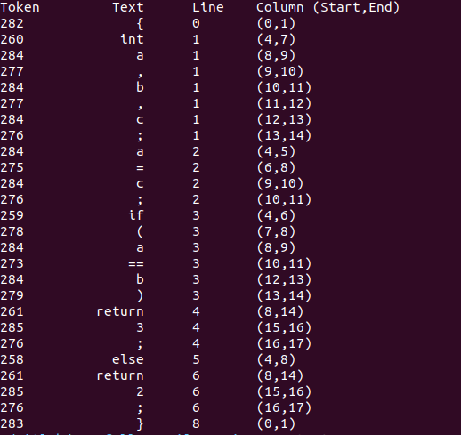
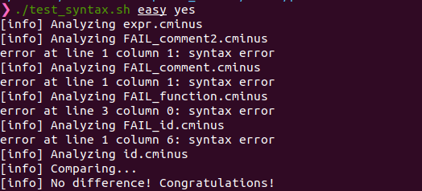
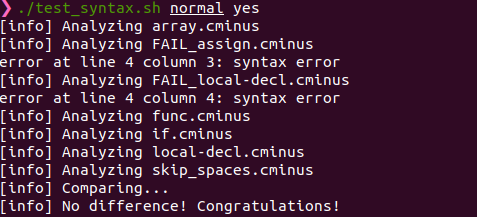
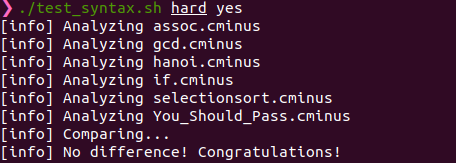
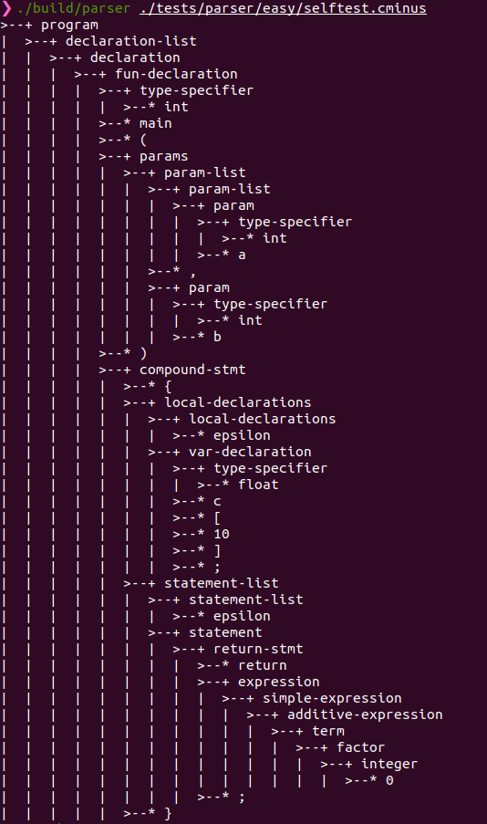

# lab1 实验报告
学号 PB19050911 姓名 陶思成

## 实验要求

1. 根据`Cminus-f`词法生成一个词法分析器
2. 根据`Cminus-f`语法生成一个语法分析器
3. 通过词法，语法的样例测试
4. 回答思考题

## 实验难点

### 	一、 词法分析器识别与处理多行注释内容

### 	二、Flex自定义模式串的使用方法

### 	三、语法分析器`%union{}`的补全

### 	四、Bsion里`<node>`的含义与使用方法

## 实验设计

​	**本次实验没有需要设计架构的地方，主体内容还是根据词法，语法~~抄写~~填写\<模式-行为\>代码部分。**

#### 使用FLex定义了词法的识别模式与对应的行为

1. 维护了`pos_start` , `pos_end`, `lines`三个变量用于debug

   识别到模式串`\n``\r`会改变这三个变量的数值

   识别到任意模式串也会改变前两个变量的数值

2. 行为中返回`yytext`，用于语法分析器构造节点

   使用`pass_node()`返回识别到的模式串对应的字符串，由后面的语法分析器使用

3. 识别注释与处理多行注释

   使用`^`取补集，进而简化注释的识别，同时根据`yytext`的内容处理多行注释带来的`lines`等变量的问题

4. 预定义模式串

   在`.l`文件开头预定义`letter`与`digit`的模式，后文直接使用预定义的模式串组成复杂的模式串

#### 使用Bison定义了语法分析器的归约方式与对应的行为

1. 根据上下文补全`%union`代码

   将`%token`都定义为`char*`的string, 将所有`%type`定义为`void*`的node

2. 实现归约

   用`$$`指示当前产生式左侧的非终结符，`$i`指代产生式右侧的第i个终结符或非终结符。

   同时调用已经写好的`node()`函数建立语法树

## 实验结果验证

1. 编译

   

   

2. 词法测试

   - 实验提供的数据

     - local-decl.cminus:

       - 程序文本：

         ```c
         int main(void) {
         	int i; float j;
         	void v;
         	return 0;
         }
         ```

       - 运行结果：

     - func.cminus:

       - 程序文本:

         ```c
         float foo(float a, float b[]) {
         	return 1;
         }
         
         int main(void) {
         	return 0;
         }
         ```

       - 运行结果:

   - **自己写的数据样例**

     - `selftest.cminus`

       - 程序文本：

         ```c
         int a = b = c;
         /* this 
         is 
         a
         test
         */
         return 0;
         ```

       - 运行结果：

     - `selftest2.cminus`

       - 程序文本：

         ```c
         {
         	int a,b,c;
             a = c;
             if (a == b)
             	return 3;
             else
             	return 2;
         }
         ```

       - 运行结果

3. 语法测试

   - 实验提供的数据

     - easy
     - normal
     - hard

   - 自己提供的数据

     - `selftest.cminus`

       - 程序文本：

         ```c
         int main(int a, int b){
             /* int a ;
             int b;
             */
             float c[10];
             return 0;
         }
         ```

       - 运行结果:

## 实验反馈

​	本次实验难度不高，主要是读懂助教给出的代码框架，然后对着语法词法规定~~抄就完事了~~仔细填写行为。


