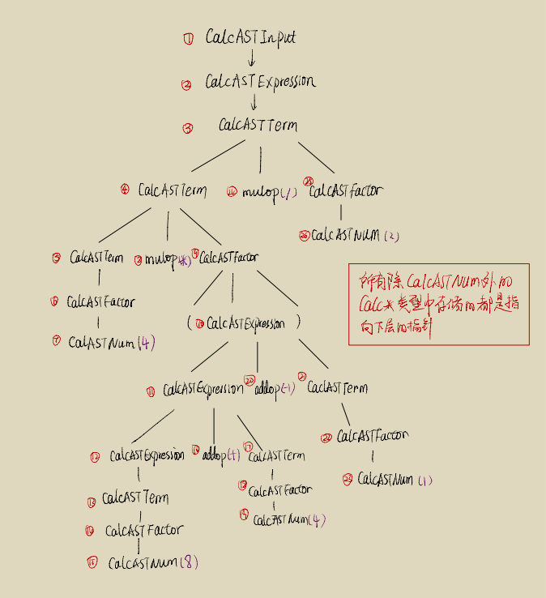
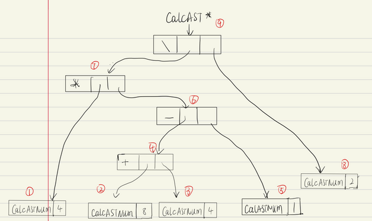

# lab2 实验报告
PB19050991 陶思成

## 问题1: cpp 与 .ll 的对应

1. ### `assign_generator.cpp` & `assign_hand.ll`

   - #### 只有一个`main()`函数：

     ```c
         // main函数
         std::vector<Type *> Ints(0);
         auto mainFunTy = FunctionType::get(Int32Type,Ints);
         auto mainFun = Function::create(mainFunTy,"main",module);
     ```

     这部分对应：

     ```llvm
     define dso_local i32 @main() #0 {
     	// 函数体
     }
     ```

     - **`main()`函数内只有一个BasicBlock：**

       ```c++
           // 基本块
           auto bb = BasicBlock::create(module,"entry",mainFun);
           builder->set_insert_point(bb);
       	
       	// 为参数与返回值分配空间 
           auto ArrayAlloca = builder->create_alloca(ArrayType::get(Int32Type,10));
           auto retAlloca = builder->create_alloca(Int32Type);
       	
       	// 各种中间操作
           auto A0GEP = builder->create_gep(ArrayAlloca,{CONST_INT(0),CONST_INT(0)});
           builder->create_store(CONST_INT(10),A0GEP);
           auto A1GEP = builder->create_gep(ArrayAlloca,{CONST_INT(0),CONST_INT(1)});
           auto A0Load = builder->create_load(A0GEP);
           auto mul = builder->create_imul(CONST_INT(2),A0Load);
           builder->create_store(mul,A1GEP);
           auto A1Load = builder->create_load(A1GEP);
           builder->create_store(A1Load,retAlloca);
       
       	// 返回
           auto retLoad = builder->create_load(retAlloca);
           builder->create_ret(retLoad);
       ```

       这部分对应：

       ```llvm
           ; %1%2 指向 数组和返回值
           %1 = alloca [10 x i32], align 64
           %2 = alloca i32, align 4
           ; %3 指向a[0] %4 指向a[1]
           %3 = getelementptr [10 x i32], [10 x i32]* %1, i32 0, i32 0
           store i32 10, i32* %3
           %4 = getelementptr [10 x i32], [10 x i32]* %1, i32 0, i32 1
           %5 = load i32, i32* %3
           %6 = mul i32 2, %5
           store i32 %6, i32* %4
           ; 保存返回值
           %7 = load i32, i32* %4
           store i32 %7, i32* %2
           ; 取返回值，返回
           %8 = load i32, i32* %2
           ret i32 %8
       ```

   
   
2. ### `fun_generator.cpp`&`fun_hand.ll`

   - #### 函数一`callee()`：

     ```c++
         std::vector<Type *> Ints(1, Int32Type);
         auto calleeFunTy = FunctionType::get(Int32Type, Ints);
         auto calleeFun = Function::create(calleeFunTy,"callee",module);
     ```

     这部分对应：

     ```llvm
     define dso_local i32 @callee(i32 %0){
     	//函数体
     }
     
     ```

     - **`callee`函数内只有一个BasicBlock:**

       ```c++
           auto bb = BasicBlock::create(module,"entry",calleeFun);
           builder->set_insert_point(bb);
       	
       	//参数与返回值的分配
           auto retAlloca = builder->create_alloca(Int32Type);
           auto aAlloca = builder->create_alloca(Int32Type);
           
       	//从列表取参数
           std::vector<Value *> args;
           for (auto arg = calleeFun->arg_begin(); arg != calleeFun->arg_end(); arg++){
               args.push_back(*arg);
           }
       	
       	//各种操作
           builder->create_store(args[0], aAlloca);
           auto aLoad = builder->create_load(aAlloca);
           auto mul = builder->create_imul(CONST_INT(2),aLoad);
           builder->create_store(mul,retAlloca);
           
       	//返回
       	auto retLoad = builder->create_load(retAlloca);
           builder->create_ret(retLoad);
       ```

       这部分对应：

       ```llvm
           ; %2,%3 指向 a与返回值
           %2 = alloca i32, align 4
           %3 = alloca i32, align 4
           store i32 %0, i32* %2
           ; 取数计算，存入%3
           %4 = load i32, i32* %2
           %5 = mul i32 2, %4
           store i32 %5, i32* %3
           ; 取出%3,返回
           %6 = load i32, i32* %3
           ret  i32 %6
       ```

   - #### 函数二`main()`：

     ```c++
         // main函数
         auto mainFun = Function::create(FunctionType::get(Int32Type,{}),"main",module);
         bb = BasicBlock::create(module,"entry",mainFun);
     ```

     这部分对应：

     ```llvm
     define dso_local i32 @main(){
     	//函数体
     }
     ```

     - **`main()`函数中只有一个BasicBlock:**

       ```c++
           builder->set_insert_point(bb);
           
       	//为返回值分配空间
       	retAlloca = builder->create_alloca(Int32Type);
           
       	//函数调用
       	auto callLoad = builder->create_call(calleeFun,{CONST_INT(110)});
           builder->create_store(callLoad,retAlloca);
       	
       	//返回
           retLoad = builder->create_load(retAlloca);
           builder->create_ret(retLoad);
       ```

       这部分对应：

       ```llvm
           ; %1 指向 返回值
           %1 = alloca i32, align 4
           ; 函数调用,将函数返回值存入%3
           %2 = call i32 @callee(i32 110)
           store i32 %2, i32* %1
           ; 取出%3,返回
           %3 = load i32, i32* %1
           ret i32 %3
       ```

       

3. ### `if_gengerator.cpp`&`if_hand.ll`

   - #### 只有一个`main()`函数：

     ```c++
         auto mainFun = Function::create(FunctionType::get(Int32Type,{}),"main",module);
         auto bb = BasicBlock::create(module,"entry",mainFun);
     ```

     这部分对应：

     ```llvm
     define dso_local i32 @main(){
     	//函数体
     }
     ```

     - **`main()`函数中有四个BasicBlock,分别为`mainBB`,`trueBB`,`falseBB`,`retBB`:**

       - **前置的定义部分`pre-definition BasicBlock`:**

         ```c++
             // pre-definition BasicBlock
             auto trueBB = BasicBlock::create(module,"trueBB",mainFun);
             auto falseBB  = BasicBlock::create(module,"falseBB",mainFun);
             auto retBB = BasicBlock::create(module,"retBB",mainFun);
         ```

         这部分在`.ll`中不好找出对应部分

       - **`mainBB` BasicBlock:**

         ```c++
             auto bb = BasicBlock::create(module,"entry",mainFun);
             builder->set_insert_point(bb);
         
             auto retAlloca = builder->create_alloca(Int32Type);
             auto aAlloca = builder->create_alloca(FloatType);
             builder->create_store(CONST_FP(0x40B1C28FE0000000),aAlloca);
             auto aLoad = builder->create_load(aAlloca);
             auto fcmp = builder->create_fcmp_gt(aLoad,CONST_FP(1.0));
           	builder->create_cond_br(fcmp,trueBB,falseBB);
         ```

         这部分对应：

         ```llvm
             %1 = alloca float, align 4
             %2 = alloca i32, align 4
             store float 0x40B1C28FE0000000, float* %1
             ; 用 fcmp 进行比较
             %3 = load float, float* %1
             %4 = fcmp ugt float %3, 1.0
             br i1 %4, label %5, label %6
         ```

       - **`trueBB` BasicBlock:**

         ```c++
             // trueBB
             builder->set_insert_point(trueBB);
             builder->create_store(CONST_INT(233),retAlloca);
             builder->create_br(retBB);
         ```

         这部分对应：

         ```llvm
         5:
             store i32 233, i32* %2
             br label %7
         ```

       - **`falseBB` BasicBlock:**

         ```c++
             // falseBB
             builder->set_insert_point(falseBB);
             builder->create_store(CONST_INT(0),retAlloca);
             builder->create_br(retBB);
         ```

         这部分对应：

         ```llvm
         6:
             store i32 0, i32* %2
             br label %7
         ```

       - **`retBB` BasicBlock:**

         ```c++
             // retBB
             builder->set_insert_point(retBB);
             auto retLoad = builder->create_load(retAlloca);
             builder->create_ret(retLoad);
         ```

         这部分对应：

         ```llvm
         7:
             ; 取%2, 返回
             %8 = load i32, i32* %2
             ret i32 %8
         ```

         

4. ### `while_generator.cpp`

   - #### 只有一个`main()`函数:

     ```c++
         auto mainFun = Function::create(FunctionType::get(Int32Type, {}),"main",module);
         auto bb = BasicBlock::create(module,"entry",mainFun);
     ```

     这部分对应：

     ```llvm
     define dso_local i32 @main(){
     	//函数体
     }
     ```

     - **`main()`函数中有四个BasicBlock,分别为`mainBB`,`cmpBB`,`trueBB`,`retBB`:**

       - **前置的定义部分`pre-definition BasicBlock`:**

         ```c++
             // pre-definition of BB
             auto cmpBB = BasicBlock::create(module,"",mainFun);
             auto trueBB = BasicBlock::create(module,"",mainFun);
             auto retBB = BasicBlock::create(module,"",mainFun);
         ```

         这部分在`.ll`中不好对应代码

       - **`mainBB` BasicBlcok:**

         ```c++
             builder->set_insert_point(bb);
         
             auto retAlloca = builder->create_alloca(Int32Type);
             auto aAlloca = builder->create_alloca(Int32Type);
             auto iAlloca = builder->create_alloca(Int32Type);
         
             builder->create_store(CONST_INT(10),aAlloca);
             builder->create_store(CONST_INT(0),iAlloca);
             auto br = builder->create_br(cmpBB); 
         ```

         这部分对应:

         ```llvm
             ; %1%2%3 指向a,i,返回值
             %1 = alloca i32, align 4
             %2 = alloca i32, align 4
             %3 = alloca i32, align 4
             ; 给a,i赋初值
             store i32 10, i32* %1
             store i32 0, i32* %2
             ; 比较 i < 10
             br label %4
         ```

       - **`cmpBB` BasicBlock:**

         ```c++
             // cmpBB 
             builder->set_insert_point(cmpBB);
             auto iLoad = builder->create_load(iAlloca);
             auto icmp = builder->create_icmp_lt(iLoad,CONST_INT(10));
             builder->create_cond_br(icmp,trueBB,retBB);
         ```

         这部分对应：

         ```llvm
         4:
             %5 = load i32,i32* %2
             %6 = icmp slt i32 %5, 10
             br i1 %6, label %7, label %13
         ```

       - **`trueBB` BasicBlcok:**

         ```c++
             // trueBB
             builder->set_insert_point(trueBB);
             iLoad = builder->create_load(iAlloca);
             auto add = builder->create_iadd(iLoad,CONST_INT(1));
             builder->create_store(add,iAlloca);
         
             iLoad = builder->create_load(iAlloca);
             auto aLoad = builder->create_load(aAlloca);
             add = builder->create_iadd(iLoad,aLoad);
             builder->create_store(add,aAlloca);
             builder->create_br(cmpBB);
         ```

         这部分对应：

         ```llvm
         7:
             ; i = i + 1
             %8 = load i32, i32* %2
             %9 = add i32 %8, 1
             store i32 %9, i32* %2
             ; a = a + i
             %10 = load i32, i32* %1
             %11 = load i32, i32* %2
             %12 = add i32 %10, %11
             store i32 %12, i32* %1
             br label %4
         ```

       - **`retBB` BasicBlcok:**

         ```c++
             // retBB
             builder->set_insert_point(retBB);
             aLoad = builder->create_load(aAlloca);
             builder->create_store(aLoad,retAlloca);
             auto retLoad = builder->create_load(retAlloca);
             builder->create_ret(retLoad);
         ```

         这部分对应：

         ```llvm
         13:
             %14 = load i32, i32* %1
             store i32 %14, i32* %3
             %15 = load i32, i32* %3
             ret i32 %15
         ```

         

     

## 问题2: Visitor Pattern
分析 `calc` 程序在输入为 `4 * (8 + 4 - 1) / 2` 时的行为：
1. 请画出该表达式对应的抽象语法树（使用 `calc_ast.hpp` 中的 `CalcAST*` 类型和在该类型中存储的值来表示），并给节点使用数字编号。

   **先画出语法分析树：**

   

   **再根据语法分析树画出抽象语法树：**

   

2. 请指出示例代码在用访问者模式遍历该语法树时的遍历顺序。

   遍历顺序就是从1\~9

   

## 问题3: getelementptr
请给出 `IR.md` 中提到的两种 getelementptr 用法的区别,并稍加解释:
  - `%2 = getelementptr [10 x i32], [10 x i32]* %1, i32 0, i32 %0`
<<<<<<< HEAD

  - `%2 = getelementptr i32, i32* %1 i32 %0`
=======
  - `%2 = getelementptr i32, i32* %1, i32 %0`
>>>>>>> 8a0b6e169ac506fe762acd0edd3fbe85c77ebd6c

    ​	两种用法的不同主要是作为GEP指令，他们的可重复参数部分不同，第一个使用了两个\<type\> \<idx\>对，第二个只  	使用了一个。

    ​	这两者出现区别的原因在于%1类型的不同:

    1. 第一行里面%1为\[10 x i32\]\*类型，第一个`i32 0`表示首先在这个数组指针的地址处取0偏移量，此时可以认为是打开成i32的指针了，后一个``132 %0`表示从第一层打开得到的i32\*的地址处取%0偏移量，最终得到i32\*的%2
    2. 第二行里面的%1就是i32\*类型，所以唯一一个参数`i32 %0`表示从%1地址处取%0的偏移量，得到i32 *的%2

    

## 实验难点
​	访问者模式分析的代码读起来有些困难，主要是`C++`的一些函数与特性不了解或不熟悉，后面经过查找资料逐渐弄明白了（应该？）

## 实验反馈
​	希望助教能做一期`C++`特殊函数的习题课，球球了（厚脸皮）

